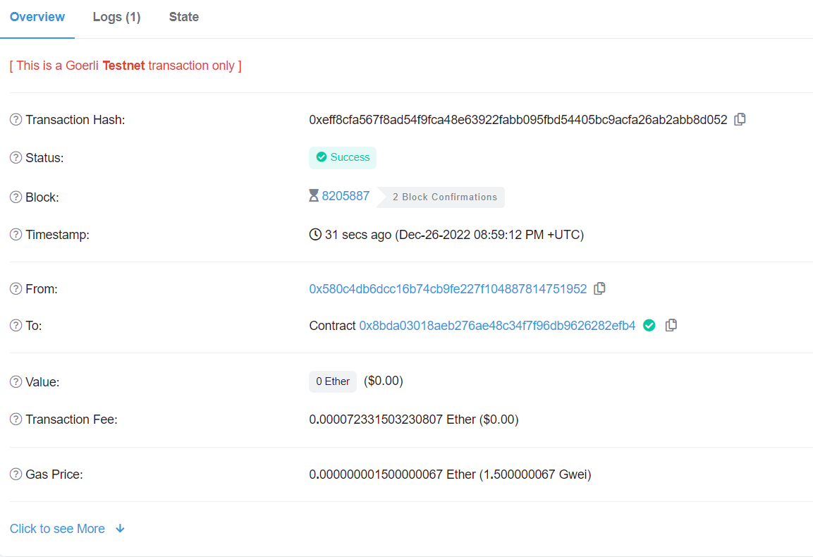
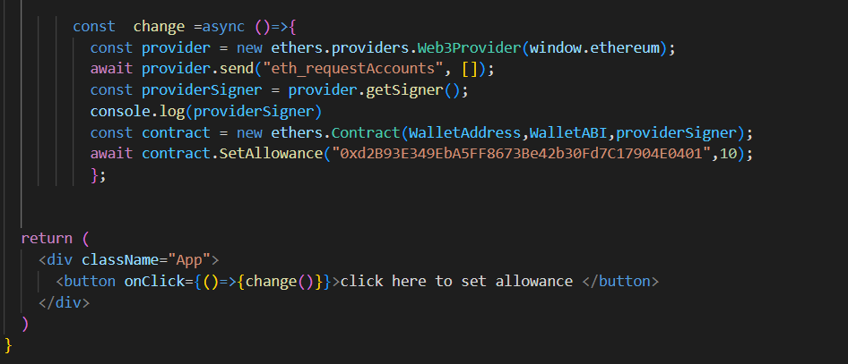

# Smart-Wallet-Project
## Intro :
 This project is of a smart wallet in which allows its owner to allot certain amount of money(ethers) to spent as a allowance and anyone can deposite any amount of         money.
 
***

## Functionality :
### Owner can :-
        - Withdraw any amount of ethers.
        - Set allowance for any account.
        - Reduce allowance by any amount which is off course less than setallowance.
        - Withdraw money to any of beneficiary without effecting the setallowance value.
        - See Owners address.
       
        
### Beneficiaries (excluding Owner) can :-
        - Withdraw less than or equal to alloted amount.
        - Withdraw less than or equal to alloted to other users in there respective accounts.
        - Reduse allowance for any user including themselves.
        - See Owners address.
        
        
### Others (who are not alloted/registered  by the Owner) can :-
         - See Owners address.
         
***
         
## Deployment :
### Clone the above repository to your local device than open the root directory i.e. Smart-Wallet-Project
##### Then run the following commands in termial (with termial pionting to root directory):-

To create the dependancies `npm init`

To install the dependancies `npm install --save-dev hardhat`

To initiate Hardhat project `npx hardhat` and then choose

>Create a Javascript Project

now project has been inititated and dependancies have been installed so you can use standard hardhat process to deploy you contract using goerli testnet as default network

### After deployment You will see the address of the deployed contract in terminal as

**The Deployed contract address is** `0x8BDa03018aeB276AE48C34F7F96DB9626282EFB4`

you can verify this transection in goerli testnet etherscan by searching for the above address transection details

## Interaction :
#### 1. you can interact with the transection using `ether.js, Web3.js` library and call its function as long as you are alloted an allowance by the owner(me) or you can deploy you own instaance and play with it.

#### 2. Also you can create a frontend to interact with it.

***

## Etherscan :

#### contract address (Goerli) : `0x8BDa03018aeB276AE48C34F7F96DB9626282EFB4`

#### The deployed transection link (Etherscan) : [Click Here](https://goerli.etherscan.io/tx/0x2e63f03df4c802fe790737a089c0610761c13a67fadfa18ad4ca845ad125cae7)

